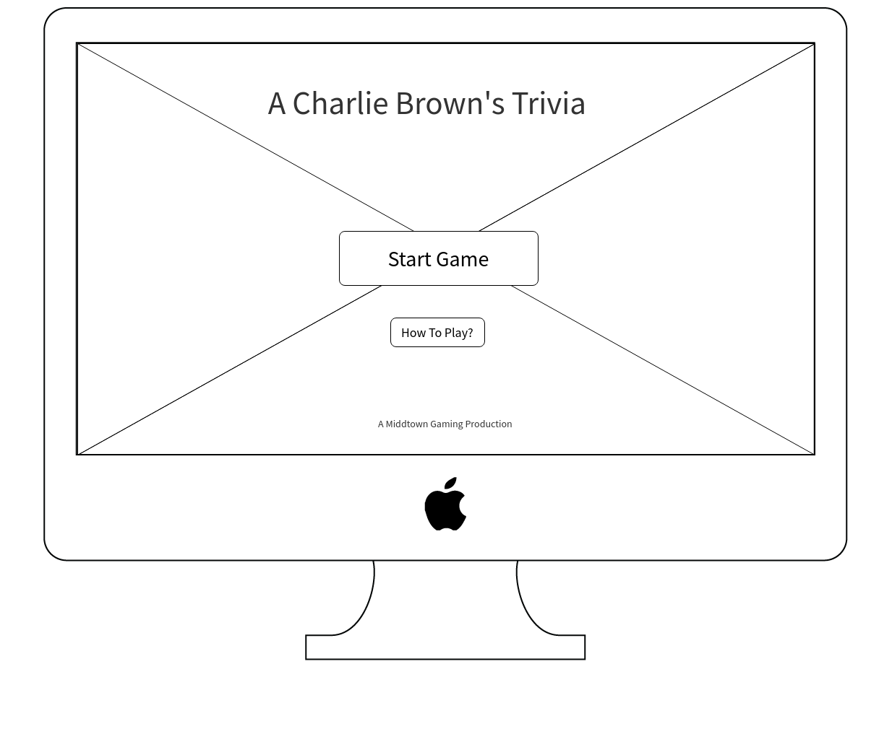
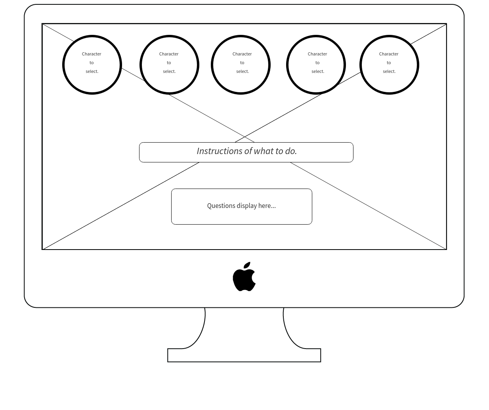

# Project1-A-Charlie-Browns-Trivia
GA Denver Project 1
 
[Trello Page](https://trello.com/b/l1rrTMiq)

## Wireframe Landing Page

## Wireframe Game Page

## Rules / How to play.
Play against the computer or play against your pal.

1. When a question appears, answer by selecting the coresponding character. 
  * This is not timed, think and answer.
  
2. The player with the most points wins!!

## Resources Used.
* Vanilla JS.
* CSS.
* Charlie Brown Images, audio and questions generated from Google.
